# KR Crew System

A Kenya Railways crew booking application for depot officers and HQ users.

## Overview

This web app manages crew status, daily bookings, monthly position registers, rest countdowns, and utilization reporting. It uses a Laravel API with MySQL storage and archived monthly exports.

## Features

- Dashboard view for crew status snapshot
- Depot-specific roster and monthly register
- Rest countdowns with auto-promote for driver rest completion
- Reports for daily status, monthly register, absences, and utilization
- Laravel JSON API backed by MySQL

## Files

- `KR_Crew_Live_v4.html` - main HTML entry point
- `app.js` - application logic, rendering, API sync, and exports
- `mysql.js` - browser data adapter for the Laravel/MySQL backend
- `helpers.js` - utility functions (CSV download, time formatting, search, etc.)
- `styles.css` - app styling
- `.gitignore` - repository ignore rules

## Setup

1. Clone the repository:
   ```bash
   git clone https://github.com/Lukewilson-1/kr-crew-system.git
   cd kr-crew-system
   ```

### Laravel Setup

This project has been converted to a Laravel scaffold. To install dependencies and run the application, use Composer and PHP:

1. Install Composer dependencies:
   ```bash
   composer install
   ```

2. Copy the environment example and configure the new file:
   ```bash
   cp .env.example .env
   ```

3. Generate an application key:
   ```bash
   php artisan key:generate
   ```

4. Start the Laravel development server:
   ```bash
   php artisan serve
   ```

5. Open the application at `http://127.0.0.1:8000`.

If Composer or PHP are not installed yet, the app can still be inspected in the generated Laravel scaffold files, but full execution requires those tools.

3. Serve the project from a local web server and open `KR_Crew_Live_v4.html`.

   You can use any static server. For example, if Python is available:
   ```bash
   python -m http.server 8000
   ```

4. Open the browser at `http://localhost:8000/KR_Crew_Live_v4.html`.

## Backend Notes

- The browser talks to Laravel JSON endpoints backed by MySQL.
- Crew records, users, admin metadata, and crew shift assignments are stored in the database.
- The superadmin account is bootstrapped from `SUPERADMIN_USERNAME` and `SUPERADMIN_PASSWORD`.
- Re-run the bootstrap with `php artisan crew:seed-superadmin`.

## Schema

The current normalized layout keeps crew identity separate from shift assignment, and the new schema migration expands that into a durable operational model:

```mermaid
erDiagram
   CREW_RECORDS {
      string record_id PK
      string depot
      string crew_id
      string staff_number
      longtext payload
      datetime created_at
      datetime updated_at
   }

   CREW_MEMBERS {
      string record_id PK
      string crew_id
      string staff_number
      string depot_code
      string display_name
      datetime created_at
      datetime updated_at
   }

   CREW_SHIFT_ASSIGNMENTS {
      string crew_record_id PK
      string record_id
      string crew_id
      string depot
      string shift
      datetime assigned_at
      datetime created_at
      datetime updated_at
   }

   CREW_STATUS_HISTORY {
      string history_id PK
      string crew_record_id
      string status_code
      string reason_code
      datetime effective_at
      datetime created_at
      datetime updated_at
   }

   DUTY_ROSTERS {
      string roster_id PK
      string depot_code
      date roster_date
      string period_label
      string status
      datetime created_at
      datetime updated_at
   }

   DUTY_ROSTER_ITEMS {
      string item_id PK
      string roster_id
      string crew_record_id
      string shift_code
      string train_type_code
      string route_code
      string rest_location_code
      date duty_date
      datetime created_at
      datetime updated_at
   }

   ADMIN_META {
      string collection PK
      string record_id PK
      json payload
      datetime created_at
      datetime updated_at
   }

   DEPOTS {
      string depot_code PK
      string depot_name
      string region
      boolean is_hq
      datetime created_at
      datetime updated_at
   }

   STATUS_CODES {
      string status_code PK
      string status_label
      integer sort_order
      boolean is_terminal
      datetime created_at
      datetime updated_at
   }

   SHIFT_TEMPLATES {
      string shift_code PK
      string shift_name
      time starts_at
      time ends_at
      boolean is_active
      datetime created_at
      datetime updated_at
   }

   TRAIN_TYPES {
      string train_type_code PK
      string train_type_name
      integer sort_order
      boolean is_active
      datetime created_at
      datetime updated_at
   }

   ROUTES {
      string route_code PK
      string route_name
      string origin_depot_code
      string destination_depot_code
      boolean is_active
      datetime created_at
      datetime updated_at
   }

   REST_LOCATIONS {
      string rest_location_code PK
      string rest_location_name
      string depot_code
      boolean is_active
      datetime created_at
      datetime updated_at
   }

   CREW_RECORDS ||--o| CREW_SHIFT_ASSIGNMENTS : "one crew row has one active shift assignment"
   CREW_RECORDS ||--o{ CREW_STATUS_HISTORY : "one crew row can have many status events"
   DUTY_ROSTERS ||--o{ DUTY_ROSTER_ITEMS : "one roster has many scheduled items"
```



Crew rows now store staff number directly, while the active shift lives in `crew_shift_assignments`. If a crew member has no assignment yet, the UI shows a default Day shift label until one is assigned.

The new migration adds the normalized lookup and operational tables without removing the existing compatibility tables, so the app can keep serving the current JSON payload flow while you transition controllers to the relational model.

## Running

- Sign in with an HQ or depot account.
- HQ users can view all depots and archived monthly exports.
- Depot officers can manage crew statuses and day-by-day assignments.

## GitHub

This repository is hosted at: https://github.com/Lukewilson-1/kr-crew-system

## License

Use and adapt this project as needed for Kenya Railways crew management.
