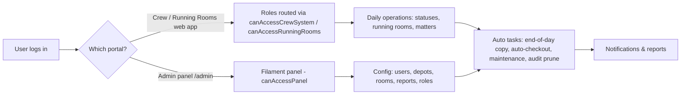
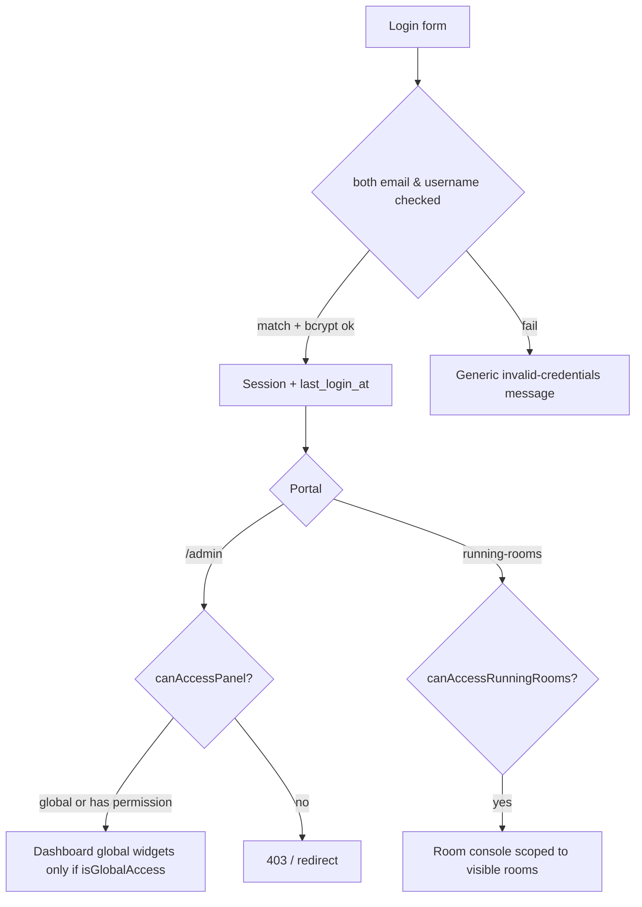
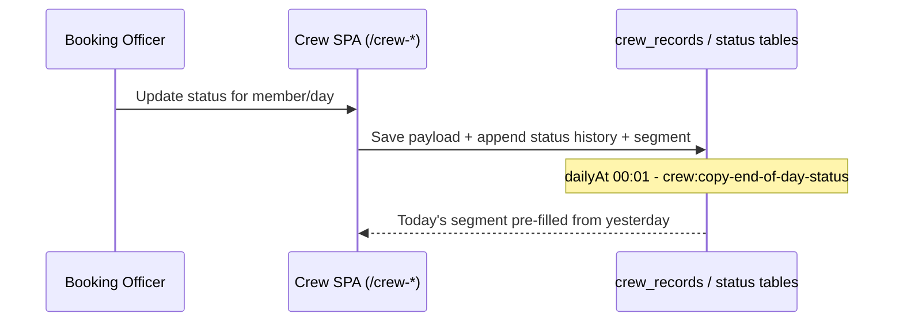
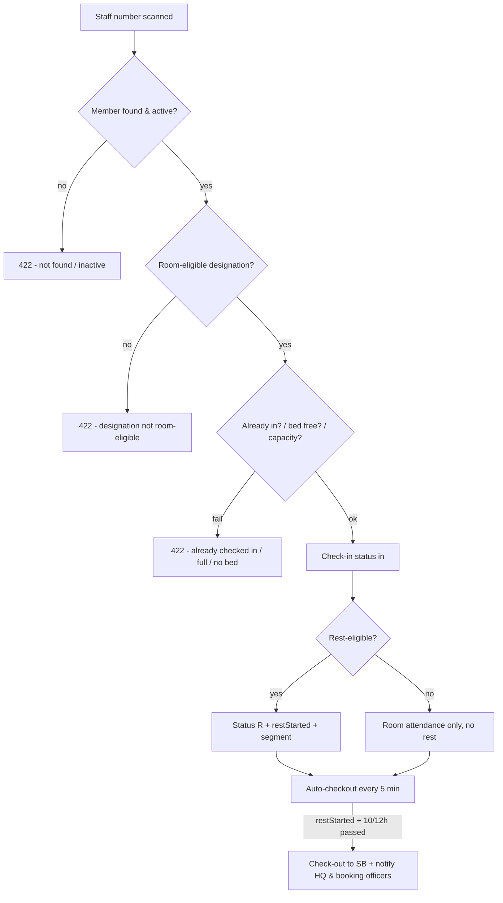
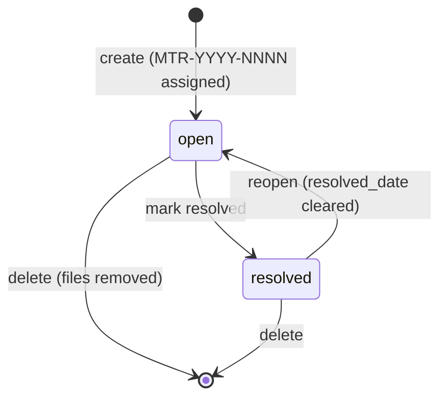
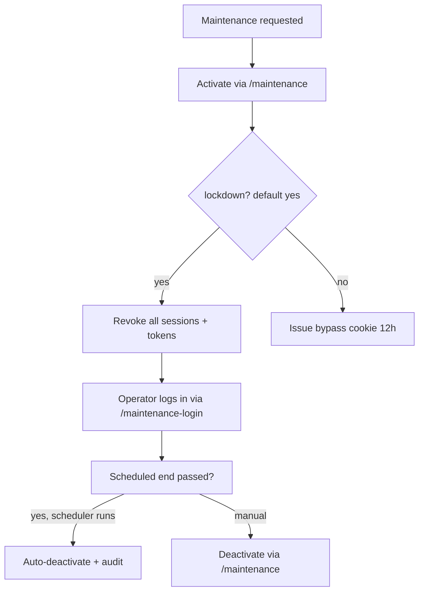

# SDLC 05 — Blueprint & Process Flows

**Project:** KR Crew & Running-Room Management System
**Status:** **DRAFTED FROM CODEBASE** — flows below mirror implementation
(`file:line` anchors). Diagrams are Mermaid (render on GitHub; also printable).

---

## 1. Blueprint overview

Top-level flow of how the system is operated, from identity to daily running.

## 2. Access & identity flow

1. Credentials resolved by **email or username**; password verified with bcrypt.
2. On success: session regenerated, `last_login_at` stamped.
3. Portal routing:
   - Crew System: any active user.
   - Running Rooms: `booking_officer`/`station_officer`/global.
   - Admin Center (Administration & national dashboard): **global access** only.
   - Operations Console: non-global users with ≥1 panel permission.
4. Failed attempts: generic message; `/mysql/login` rate-limited 5/60 s.

## 3. Crew daily-status flow

1. Booking officer opens crew SPA and works on **today's** status grid for the depot.
2. Changing status writes: `crew_records.payload`, normalized `crew_status_history`,
   and a closed/open segment in `crew_status_segments` (rest entries carry
   `restStarted`, `awayDepot`, `monthly[day]`).
3. **End-of-day copy** (`crew:copy-end-of-day-status`, 00:01): if today's segment is
   absent, copy yesterday's last status into today (`sort_order=100`, note
   "Auto-copied…"); fallback to `payload.monthly[day]`.
4. Past-day edits allowed within `CREW_PAST_DAY_EDIT_WINDOW_DAYS` (2 days).

## 4. Running-room check-in / rest / auto-check-out flow

1. Attendant/booking officer checks in crew by **staff number**.
2. Validations: room manageable; member active; designation **room-eligible**; not
   already checked in; bed available (`B1..Bn`); capacity free that day.
3. On success, if designation is **rest-eligible**:
   - Crew status → `R`; `restStarted` = arrival (UTC); `awayDepot` set when room depot
     ≠ crew depot; segment recorded "Running room: …".
   - Non-rest-eligible (shunter, PSA): recorded as in-room only, no `R` status.
4. **Rest duration:** 12 h at home depot, 10 h away.
5. **Auto-check-out** (`running-rooms:auto-checkout-rested`, every 5 min): any `in`
   guest whose `restStarted + restHours` has passed is checked out (`out`),
   `rrCheckedOut=true`; crew returned to `SB`; notifications sent.
6. Manual check-out / deletion also performs the crew sync.

## 5. Matters arising flow

1. Create matter against a room: category, description, reporter (default current
   user), optional photos (≤5 MB, images only).
2. System assigns ticket **`MTR-YYYY-NNNN`** (per-year sequence) and status `open`.
3. Update allowed: rescue→`open`, resolve→`resolved` (records `resolved_date`, kept on
   further edits, cleared if reopened).
4. Printable matters report: date/status/room/category filters, per-room/per-category
   stats, photos embedded ≤2 MB.

## 6. Report & access flow

1. Portal reports and decision-support index (`/reports/system`) list enabled reports.
2. Visibility scoping: inactive user → none; global → all depots; depot user → own
   depot; attendant → own room.
3. Governance reports (Secure Access, PII Audit, Login Security) → `isGlobalAccess()`
   only.
4. Filters (date ranges, depots, status) → generated rows; printable KR-letterhead HTML.

## 7. Notification flow

1. Event (auto-check-out) → persist `system_notifications` row (recipient, type, title,
   body, data).
2. Best-effort e-mail via SMTP when `notifications.email.enabled=true`; success stamps
   `email_delivered_at`.
3. In-app: bell lists latest 50, unread count, mark-read.
4. Admin alerts e-mailed to `ALERT_EMAIL_RECIPIENTS`.

## 8. Maintenance / break-glass flow

1. **Maintenance:** control page `/maintenance` (maintenance credentials) → activate
   (optional scheduled end, `Africa/Nairobi`) → hard lockdown wipes all sessions +
   remember tokens, operator re-signs in via `/maintenance-login`; banner shown.
   Scheduled end → `maintenance:auto-deactivate` (every minute) brings site back.
2. **Break-glass:** enabled only when configured; requires username+password +
   justification (20–2000 chars); gives 8 h session as `login_as` target; auto-expired
   by middleware with audit entries.

## 9. Scheduled tasks (blueprint of the automation layer)

| Task | Cadence | Command |
|---|---|---|
| End-of-day status copy | daily 00:01 | `crew:copy-end-of-day-status` |
| Running-room auto-check-out | every 5 min | `running-rooms:auto-checkout-rested` |
| Maintenance auto-deactivate | every min | `maintenance:auto-deactivate` |
| Audit log retention | daily | `audit:prune --retention=365` |
| Webhook fallback | 5 min (external) | `GET /running-rooms/cron/auto-checkout?token=` |

---

## Appendix A — Process-flow review sign-off (TO BE COMPLETED)

| Reviewer | Area reviewed | Findings | Sign-off | Date |
|---|---|---|---|---|
| | Crew status flow | | | |
| | Running rooms flow | | | |
| | Matters flow | | | |
| | Reports / access flow | | | |
| | Maintenance / break-glass | | | |

---
*Next: [06 — System Architecture](06-System-Architecture.md)*