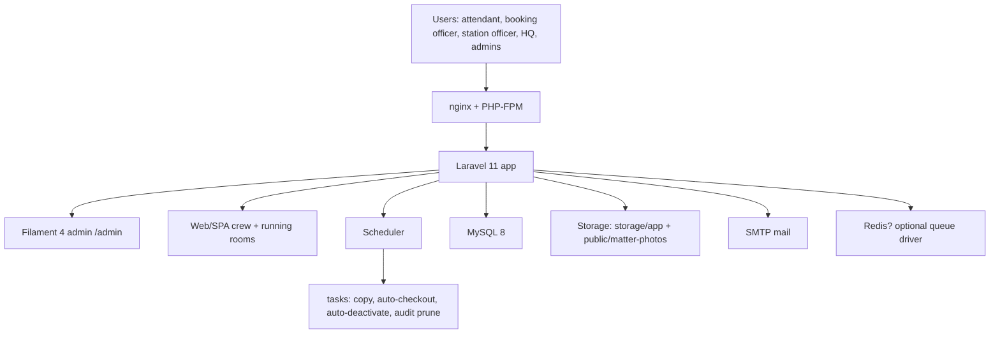
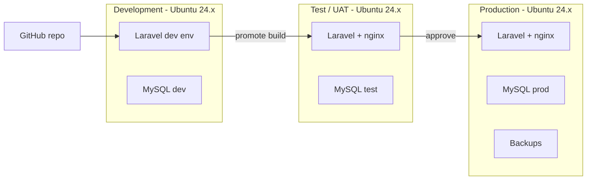

# SDLC 06 — System Architecture

**Project:** KR Crew & Running-Room Management System
**Status:** **DRAFTED FROM CODEBASE** (as-delivered + target 3-environment rollout)

---

## 1. Architecture summary

Laravel 11 (PHP ^8.2) monolithic web application with a Filament 4 admin panel and
Vite/Tailwind front-end, backed by MySQL, delivering three logical surfaces:

- **Web app (SPA pages + server-rendered)** for crew and running-rooms operations.
- **Admin panel (`/admin`)** for configuration, security and reporting.
- **Automation layer** (Laravel scheduler / cron) for end-of-day copy,
  auto-check-out, maintenance auto-deactivate, audit pruning.
- **Notification layer** (in-app + SMTP e-mail).

## 2. Technology stack (as-delivered)

| Layer | Technology | Version | Notes |
|---|---|---|---|
| Language | PHP | ^8.2 | Ubuntu 24.04 native PHP 8.3 recommended |
| Framework | Laravel | ^11 | |
| Admin panel | Filament | ^4.0 | |
| Charts | leandrocfe/filament-apex-charts | 5.0 | |
| Rich text | tonysm/rich-text-laravel | ^3.11 | |
| Front-end build | Vite + Tailwind 3 + Alpine | — | assets built via `npm run build` |
| JS libs | Axios, jQuery, ApexCharts, Laravel Echo, Pusher | — | Pusher not currently consumed server-side |
| Database | MySQL | 8.x | |
| Web server | Nginx + PHP-FPM | — | |
| OS (target) | Ubuntu 24.04 LTS | — | see `12-…` |
| Mail | SMTP | — | `notifications:test-email` |
| Queue | sync by default; configurable | — | `queueOrSend()` honours queue driver |
| Cache | file/database; OPcache in prod | — | |

## 3. Component model

### 3.1 Application modules
- `app/Http/Controllers` — web/JSON endpoints (Home, Crew, CrewData, AdminMeta,
  RunningRoom, Maintenance, Report, Auth/*).
- `app/Filament` — admin panel resources, pages, widgets, auth login.
- `app/Models` + `app/Models/*` — Eloquent models (32-table schema).
- `app/Reports` — SystemReport contract + 13 decision-support reports + registry.
- `app/Services` — AuditLogger, NotificationService.
- `app/Console/Commands` — scheduled/operational commands.
- `app/Policies` — per-resource permission enforcement.
- `app/Observers` — EloquentAuditObserver (User, Role, Permission, CrewMember, CrewRecord).

### 3.2 Database (32 tables — see SYSTEM_DOCUMENTATION.md Appendix D & `03-System-Analysis.md` §5)
Key clusters: people/org, crew status (with `crew_status_segments` day-grid),
running rooms (`rooms`, `room_beds`, `attendance_records`, concurrency unique indexes),
matters(+photos), rosters, security (RBAC pivots, `audit_logs`), notifications, reports registry.

### 3.3 Security architecture
- bcrypt passwords; CSRF (excl. 2 maintenance routes); throttling (login 5/60 s,
  mutations 120/min); `NoStore` cache headers; RBAC policies; append-only audit log
  with secret redaction; break-glass (8 h, justification, middleware expiry);
  maintenance lockdown (session/token revocation); credential rotation commands.

## 4. Environment architecture (Dev / Test / Prod — target)

- Each environment isolated; **only test data in Dev/Test**; Test is the UAT target
  (see `12-…` for per-server specs and `09-Commissioning.md` for rollout).

## 5. Runtime configuration (key points)

| Concern | Configuration |
|---|---|
| App env | `APP_ENV=local/test/production`; `APP_DEBUG=false` in Test/Prod |
| Scheduler | system cron: `* * * * * php artisan schedule:run` |
| Queue | default `sync`; for Prod use Redis+worker via Supervisor if async preferred |
| Storage | `storage/app/*`, `storage/framework`, `public/matter-photos`; back up all |
| Mail | SMTP creds in `.env` |
| Secrets | never commit; rotate per maintenance/break-glass commands |

## 6. Deployment approach

- **Source:** git repo `master` (release commits tagged).
- **Build:** `composer install --no-dev`, `npm ci && npm run build`, config caches
  (`php artisan config:cache`, `route:cache`, `view:cache`) in Test/Prod.
- **Serving:** Nginx → `public/`; note this app previously exhibited view-cache
  quirks locally (avoid caching views during active maintenance testing on dev box).
- **Migration:** `php artisan migrate --force`.
- Full procedure: `DEPLOYMENT_GUIDE.md`.

## 7. Non-functional architecture notes

- **No automated tests today** — see System Analysis §9 open items; CI to be added
  with a Test-stage gate.
- **Performance:** small data volumes; index-backed; recommend OPcache + `APP_DEBUG=false`
  in Test/Prod.
- **Observability:** Laravel logs (`storage/logs`), audit log, notifications; external
  monitoring TBD (`09-Commissioning.md`).

## 8. Sign-off (TO BE COMPLETED)

| Role | Name | Signature | Date |
|---|---|---|---|
| Solution architect | | | |
| Dev lead | | | |
| ICT infrastructure | | | |

---
*Next: [07 — UAT](07-UAT.md)*