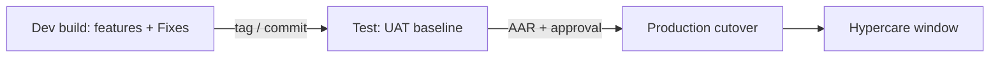

# SDLC 09 — Commissioning (Go-Live)

**Project:** KR Crew & Running-Room Management System
**Status:** CHECKLIST/TEMPLATE — **TO BE COMPLETED BY ICT/PM** at go-live

---

## 1. Purpose

Define the controlled rollout **Development → Test → Production** and the go-live
(dry-run → cutover → hypercare), plus rollback. Environments are specified in
`12-Server-Environment-Requirements.md`.

## 2. Release acceptance gates

| Gate | Owner | Evidence | Signed? (date) |
|---|---|---|---|
| System Analysis approved | BA + Sponsor | `03-System-Analysis.md` §11 | |
| UAT passed (Test env) | QA + Business | `07-UAT.md` §7 | |
| Training delivered | Business/ICT | `08-Training.md` §6 | |
| Pre-production hardening done | ICT | §4 below | |
| Go/No-Go decision | Sponsor/PM | §8 | |

## 3. Environment promotion flow

- **Dev:** developer machines / Dev server (Ubuntu 24.x).
- **Test:** mirrors production config (PHP 8.3, OPcache, `APP_DEBUG=false`); used for
  UAT + training.
- **Prod:** restricted access; backups enabled; monitoring in place.

## 4. Pre-production hardening checklist (ICT)

- [ ] No default credentials: superadmin, maintenance, break-glass passwords rotated;
      stored in vault/env (see `11-Credentials.md`).
- [ ] `APP_ENV=production`, `APP_DEBUG=false`.
- [ ] `CRON_TOKEN` set (webhook otherwise returns 401).
- [ ] TLS certificate configured; `APP_URL=https://…`.
- [ ] `storage`, `public/matter-photos` writable by web user; chmod/ACL verified.
- [ ] Backups: `mysqldump` (or equivalent) + storage backup scheduled; restore drill done.
- [ ] SMS/email alert recipients configured (`ALERT_EMAIL_RECIPIENTS`) + test e-mail sent.
- [ ] Caches built: `config:cache`, `route:cache` (view cache optional per deployment notes).
- [ ] Scheduled tasks installed in cron: `* * * * * php artisan schedule:run`.
- [ ] Queue worker if async queue selected (Supervisor config).
- [ ] Firewall rules applied (UFW); fail2ban if required; SSH key-only.
- [ ] DB users minimal (app user has DB access only; no shell).
- [ ] `php artisan migrate --force` run on production DB; schema verified.

## 5. Cutover plan

| Step | Owner | Time/window | Done |
|---|---|---|---|
| Freeze business data entry (parallel-run acceptable) | Ops | | |
| Final `composer install --no-dev` + build assets | ICT | | |
| Migrations applied (backup first) | ICT | | |
| Config/route caches refreshed | ICT | | |
| Smoke tests (login, one depot, one running room, one matter) | QA | | |
| Announce go-live + switch users | PM/ICT | | |

## 6. Data migration & backfill

**TO BE COMPLETED** — assess importing legacy registers:
- Crew master/master-data: source spreadsheets → import design/format **TBD**.
- Running-room stays/matters: retrospective data **optional** (matters ticket numbers
  will be re-issued).
- Note: legacy plaintext password bridge was **removed** (v1.5) — user passwords must
  be reset or migrated to bcrypt via import.

## 7. Rollback plan

- Restore last DB backup + application build to previous tag.
- Expect up to ~1 h for outage; communications pre-agreed.
- Trigger if: critical data loss, blockable security defect, or sustained outage
  beyond 2 h.

## 8. Post-implementation review (PIR) — TO BE COMPLETED

| Item | Owner | Result/date |
|---|---|---|
| Hypercare daily review (first 2 weeks) | PM/ICT | |
| Support duty roster | ICT | |
| Open defects from UAT closed | Dev | |
| Lessons learned recorded | PM | |

## 9. Commissioning sign-off

| Role | Name | Signature | Date |
|---|---|---|---|
| PM | | | |
| ICT lead | | | |
| Business sponsor | | | |
| QA | | | |

---
*Next: [10 — System Manuals](10-System-Manuals.md)*